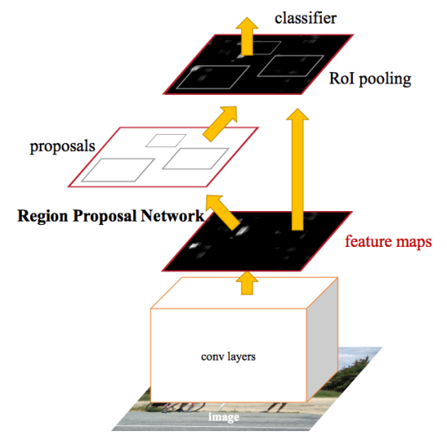

# Заголовок уровня 1
## Заголовок уровня 2
### Заголовок уровня 3

Просто текст

*пропись*

**жирный**

***жирная пропись***

[Ссылка](#субъект-ссылки)

## Список
1. Элемент списка первого уровня вложенности<br>
  1.1. Элемент второго уровня вложенности<br>
      1.1.1. Элемент третьего уровня вложенности<br>
      1.1.2. [Метод k ближайших соседей](#Метод-k-ближайших-соседей)<br>
      1.1.3. [Метод k взвешенных ближайших соседей](#Метод-k-взвешенных-ближайших-соседей)<br>
2. Элемент списка первого уровня вложенности<br>


## субъект ссылки

Таблица средствами markdown:

Сравнение осуществленных алгоритмов:
|Алгоритм       |параметры           |ошибка|
|---------------|--------------------|------|
|1NN            |k = 1               |7     |
|kNN            |k = 6               |5     |
|**kwNN**       |**k = 3, q = 0.7**  |**6** |
|Parzen         |h = 0.4             |6     |
|Potential      |h = 0.4,            |6     |

Таблица средствами html:

<table>
 <tr>
  <td>
   строка 1, столбец 1
  </td>
  <td>
   строка 1, столбец 2
  </td>
</tr>

 <tr>
  <td>
   строка 2, столбец 1
  </td>
  <td>
   строка 2, столбец 2
  </td>
 </tr>
</table>

Код на языке R:

```R
#евклидова метрика
EM <- function(u, v) {
  return(sqrt(sum((u - v) ^ 2)));
}
```

Код на языке Python:

```Python
def foo(bar: int):
	...
```

Картинка


Другой список:
- элемент 1
- элемент 2